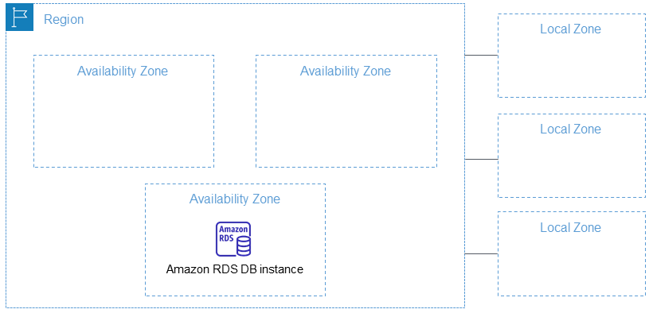

# Introduction

## Regions, Availability Zones, and Local Zones

Understanding AWS Regions, Availability Zones, and Local Zones is crucial for optimizing your AWS infrastructure for performance, compliance, and cost-effectiveness.
This guide explores the key concepts and considerations.

> Each AWS Region is designed to be **completely independent** from others, enhancing fault tolerance and stability.

### Choosing Regions

Consider these factors when selecting an AWS region:

1. **Compliance**

    Ensure adherence to data governance and legal requirements when selecting a region for data storage and processing.

1. **Proximity**

    A region closer to your customer base can significantly reduce latency, improving user experience.

1. **Available services**

    Services availability may vary across regions. For instance, [specific service] is only available in [specific regions].

1. **Pricing**

    Costs vary by region. For detailed pricing, visit the [AWS service pricing page](https://aws.amazon.com/pricing/).

### AWS Availability Zones (AZ)

Each region comprises several Availability Zones.
Each zone represents one or more discrete data centers, equipped with redundant power, networking, and connectivity.
These zones are interconnected with high bandwidth and ultra-low latency networking.

## Global Services

AWS has Global Services.
A service is **Global** when the top right shows **Global**.

- Identity and Access Management (IAM)
- Route 53 (DNS Service)
- CloudFront (Content Delivery Network)
- WAF (Web Application Firewall)

## Region-Scoped Services

- Amazon EC2 (Infrastructure as a Service)
- Elastic Beanstalk (Platform as a Service)
- Lambda (Function as a Service)
- Rekognition (Software as a Service)
