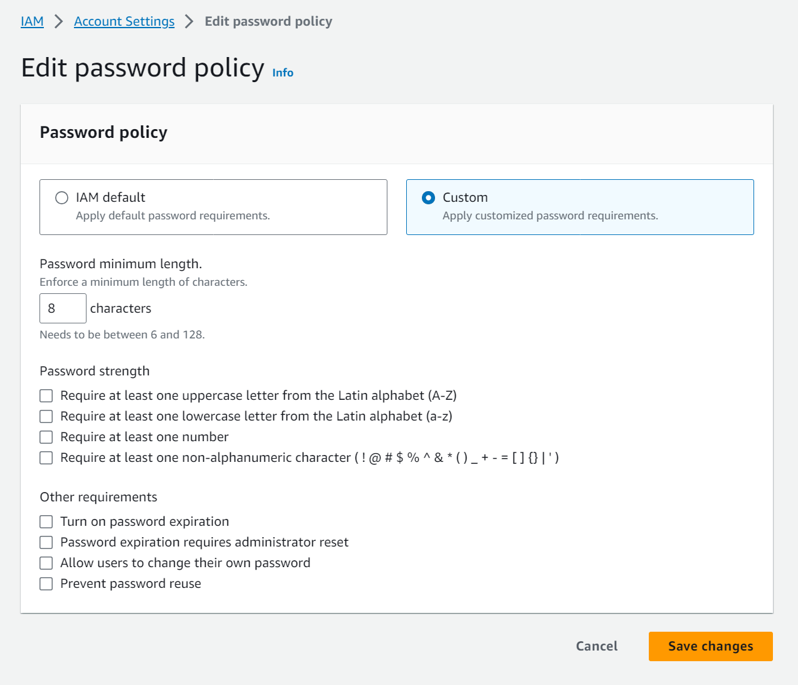
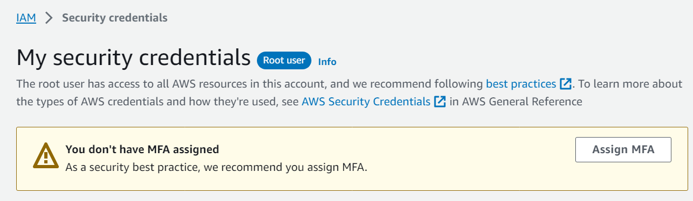

# Access Controls and Management across Multiple Accounts

Understanding AWS Identity and Access Management (IAM) is crucial for securely managing access to AWS services and resources.
IAM enables centralized management of users, groups, and permissions, ensuring that only authorized entities can access your AWS environment.

## AWS Identity and Access Management (AWS IAM)

> IAM, standing for Identity and Access Management, is a cornerstone of AWS security.
It allows for detailed control over who can access what resources in AWS, promoting secure and efficient management of permissions.

### Account Types

AWS IAM supports two main account types:

1. **Root Account**

    The root account is the initial account created with AWS.
    It has full access to all AWS services and resources.
    It's recommended to use the root account only for initial setup tasks and billing purposes.

1. **Non-Root Account**

    These are accounts created within AWS for day-to-day operations.
    They are assigned specific permissions to limit access and enhance security.

### Users and Groups

In AWS IAM, users and groups are fundamental concepts for access control:

1. **Users**

    A user represents an individual or an entity in your organization.
    Users can be assigned individual permissions or grouped into a group.
    Each user can belong to multiple groups, inheriting the permissions of the groups they are a part of.

1. **Groups**

    Groups are a collection of users, usually defined by their role (like developers, administrators).
    Groups facilitate easier management of permissions, as any permission assigned to a group automatically applies to all users in the group.
    Groups cannot contain other groups.

For example, Bob can be part of the developers group and also the administrators group, gaining the permissions of both.

### IAM Permissions

Permissions in AWS IAM are defined using policies, which are JSON documents describing what actions are allowed or denied.
Applying the least privilege principle is critical in IAM;
users and groups should only have the permissions necessary to perform their job functions.

### IAM Policies Structure

IAM policies are structured as follows:

- **Version**

    Defines the version of the policy language.
    Always use `2012-10-17`.

- **Id**

    An optional identifier for the policy.

- **Statement**

  A series of individual statements, each defining a specific permission. Key elements include:

  - **Sid**

    An optional identifier for the statement.
    Used for management and tracking purposes.

  - **Effect**

    Determines the nature of the access (either Allow or Deny).
    Importantly, a Deny statement will always override any Allow statements.

  - **Principal**

    Specifies the user, account, service, or other entity that is allowed or denied access.
    This element is used in resource-based policies, like those in S3, but not in identity-based policies.

  - **Action**

    Specifies the actions permitted or prohibited by the policy.
    This can range from specific actions (like `s3:GetObject` for retrieving an object from S3) to broader categories using wildcards (e.g., `s3:Get*` for all 'get' actions in S3, or `*` for all actions in a service) and even a list of actions.

  - **Resource**

    Identifies the AWS resources to which the policy applies, using Amazon Resource Names (ARNs).
    ARNs can be used to specify resources precisely (like a specific S3 bucket) or broadly (such as all resources in an account) and can incorporate wildcards for flexible resource selection.

  - **Condition**

    Optional.
    Defines the circumstances under which the policy grants or denies permission.
    Conditions can include various elements like time of day, client IP, AWS Tags, etc., adding an extra layer of control to the policy.

These components work together to form a policy that precisely defines and controls access within the AWS environment.

An example of an IAM policy:

```json
{
    "Version": "2012-10-17",
    "Statement": [
        {
            "Sid": 1,
            "Effect": "Allow",
            "Action": "s3:ListAllMyBuckets",
            "Resource": "arn:aws:s3:::*"
        },
        {
            "Effect": "Allow",
            "Action": "s3:GetBucketLocation",
            "Resource": "arn:aws:s3:::*"
        },
        {
            "Effect": "Allow",
            "Principal: {
                "AWS": [
                    "arn:aws:iam::12345:root"
                ]
            },
            "Action": [
                "s3:GetObject",
                "s3:PutObject"
            ],
            "Resource": "arn:aws:s3:::*"
        },
        {
            "Effect": "Allow",
            "Action": "s3:*",
            "Resource": "arn:aws:s3:::ExampleBucket/*"
        }
    ]
}
```

- `s3:ListAllMyBuckets`

    The statement allows the listing of all S3 buckets within the account.

- `s3:GetBucketLocation`

    The statement allows the retrieval of the location information of any S3 bucket.

- `s3:*` with `arn:aws:s3:::ExampleBucket`

    The statement grants full access to the objects within the `ExampleBucket`

## IAM Password Policy

> Navigation: IAM > Account Settings > Edit password policy



A strong password policy enhances security by increasing password entropy. In AWS, you can customize your password policy to enforce robust security standards. The policy settings can include:

- **Minimum Password Length**

    Specify the required length for passwords.

- **Character Requirements**

    Enforce the inclusion of various character types such as uppercase, lowercase, numbers, and non-alphanumeric characters.

- **User Password Changes**

    Allow IAM users to change their own passwords.

- **Password Expiration**

    Set a mandatory duration after which users must change their passwords.

- **Password Reuse Prevention**

    Restrict users from reusing previous passwords.

## Multi Factor Authentication (MFA)

> Navigation: IAM > Security credentials



MFA adds an additional layer of security to your AWS accounts, protecting against unauthorized access even if a password is compromised.
MFA is particularly crucial for Root Accounts and IAM users with extensive permissions.

Types of MFA devices include:

- **Virtual MFA Device**

    A software-based security token that generates time-based, one-time passcodes.

- **Universal 2nd Factor (U2F) Security Key**

    A physical security key that follows the U2F standard for two-factor authentication.

- **Hardware Key Fob MFA Device**

    A physical device that generates a one-time passcode for authentication.

## Accessing AWS

AWS can be accessed in three primary ways, each with its own security mechanisms:

- **AWS Management Console**

    Accessible via a web browser and protected by a password and MFA.

- **AWS Command Line Interface (CLI)**

    Accessed through a command-line tool and protected by access keys.

- **AWS Software Developer Kit (SDK)**

    Used in programming and application development, secured with access keys.

Access keys consist of an Access Key ID (akin to a username) and a Secret Access Key (similar to a password), which users manage and generate through the AWS console.

### AWS CLI

AWS CLI is a tool that enables you to interact with AWS services using the command-line shell.
It has direct access to public APIs of AWS servies.
It also allows you to develop scripts to manage your AWS resources.
The AWS CLI is [open-source](https://github.com/aws/aws-cli).

## Related AWS Concepts

Understanding IAM also involves familiarity with related AWS concepts:

- **AWS Global Infrastructure**

    This includes Availability Zones and AWS Regions, which are integral to understanding how to deploy and manage AWS services.

- **AWS Security Best Practices**

    These practices include the principle of least privilege, emphasizing the importance of granting only the necessary permissions.

- **The AWS Shared Responsibility Model**

    This model outlines what AWS manages versus what the customer is responsible for in terms of security and compliance.
